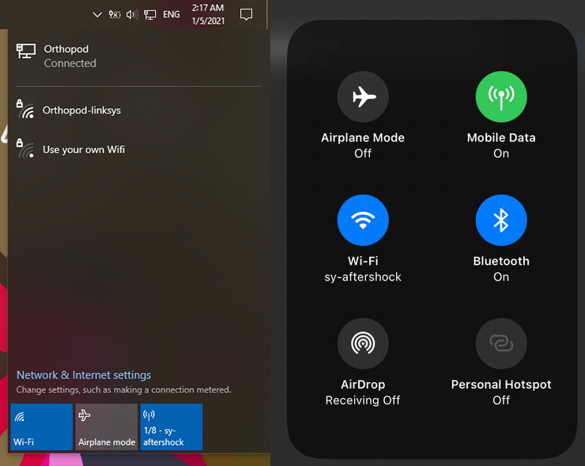
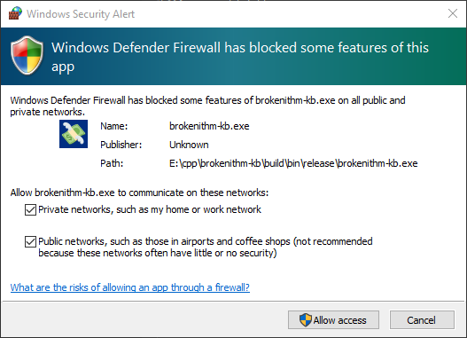
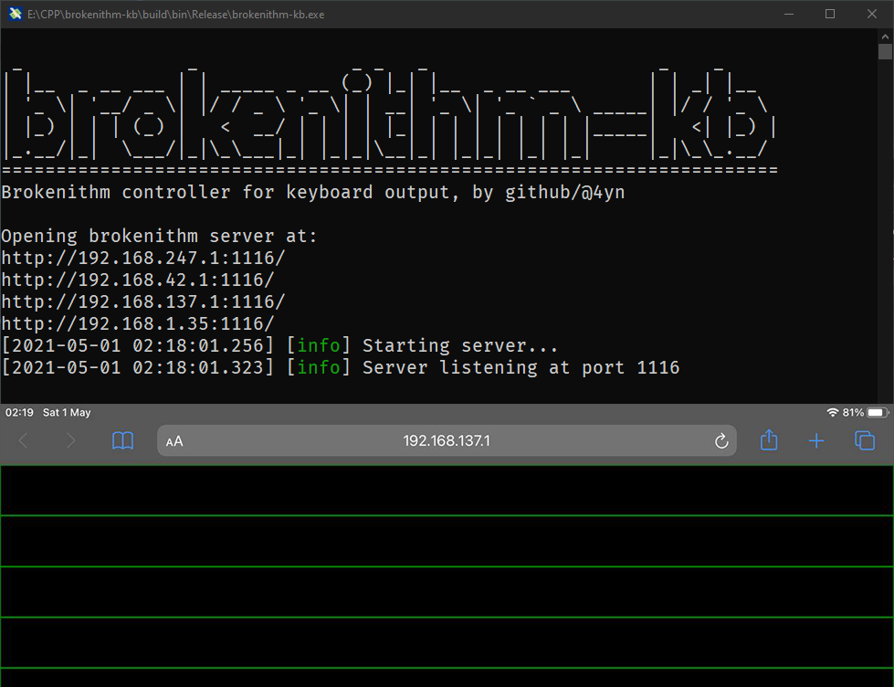
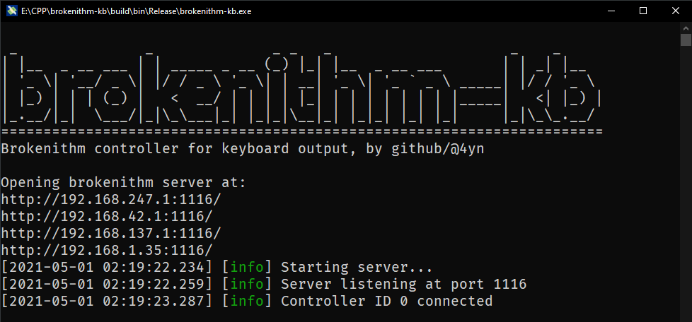
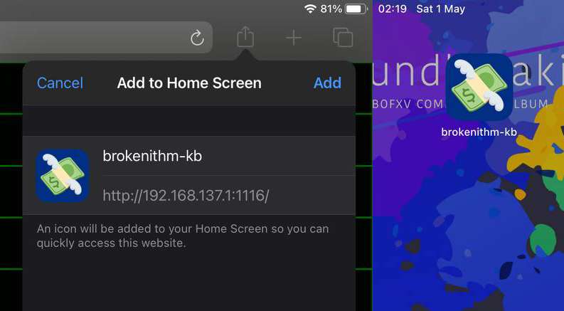
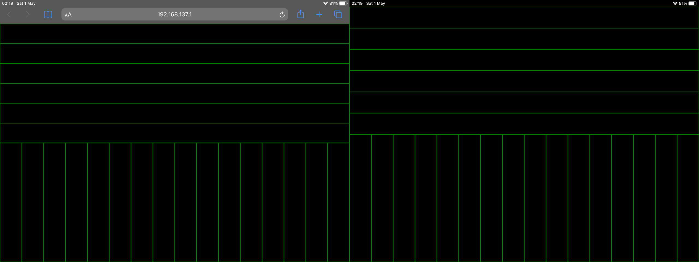
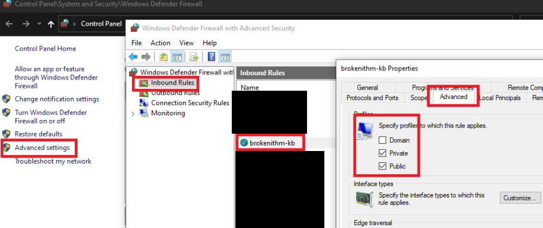

# brokenithm-kb 💸

> Because $300 plus shipping and a two month wait is too painful for a tasoller

Run this together alongside SUSPlayer or your other favourite sliding universal score simulator to play with a tablet device.

[Demo play](https://www.youtube.com/watch?v=xhxCB26Jqf4)


## Setup

1. Check the releases page on github, download and unzip into your preferred folder.
2. Connect an iPad or some other tablet device to the **same wifi access point** as your windows machine.

   > Windows hotspot also works, just make sure you turn on the hotspot before running `brokenithm-kb.exe`.

   

3. Run `brokenithm-kb.exe`.
4. If this is the first time running the program, give the program firewall permissions.

   

   > When using windows hotspot, ensure "public" is enabled. If there are any other issues, try checking the "incoming rules" menu of windows firewall from the control panel.

   > You may need to grant firewall permissions the first time and then restart the program.

5. Some URLs should be displayed on the command line window, try opening each one of them in your tablet device until you see the controller screen.

   

6. If you see "Controller ID ? Connected" on the console, the controller is working!

   

7. Open up SUSplayer or some other simulator and have fun!

   > Make sure to set `InputType=1` in SUSPlayer's `Config.ini`; this program simulates the Yuancon keyboard layout

### Further Setup

I also recommend using the "Add to home" feature for Safari / Chrome, it makes the controller fullscreen. After that you can also use "guided access" mode to disable the iOS app switcher gestures.



The difference between Safari and "Add to home" looks like this:



## Options

Options for the server can be changed with command line arguments, check `.\brokenithm-kb.exe -h` or edit `run.bat`.

Example usage:

```bat
REM Just run brokenithm-kb
.\brokenithm-kb.exe

REM View help
.\brokenithm-kb.exe -h

REM Run on a different port
.\brokenithm-kb.exe -p 1117

REM Run polling rate of 1000 times a second (default is 100)
.\brokenithm-kb.exe -f 1000

REM Run in verbose mode to check if button presses are detected
.\brokenithm-kb.exe -v

REM Run in verbose + dry run mode which doesn't send any keypreses
.\brokenithm-kb.exe -v -d
```

Appearance of the touchscreen controller can be changed by editing `./res/www/config.js`.
You can change the displayed colors and also add a background image URL to the controller. Just upload an image to imgur or somewhere else and place the link there.

## Troubleshooting

> I can open the webpage controller in chrome on the windows computer itself but clicking does not do anything

The webpage controller only detects touch input; try use your web browser's devtools and enable ["Touch Device" mode](https://developer.chrome.com/docs/devtools/device-mode/#viewport), then try again.

> I can access the webpage controller on my windows machine but not on my device

- Make sure your devices are connected to the same wifi / ethernet hospot.
- Try using windows hotspot.
- Try running as administrator.
- Try changing the port used for the server (see [Options](#Options))
- Double check that your firewall is set up correctly.



## Building from source

Needs cmake and the `libuv:x64-windows` vcpkg package.

Built on windows `cl.exe 19.28.29337`.

If anyone knows enough C++/cmake/CI to help out with making this section better do pm me.

## Attribution

[uWebsockets](https://github.com/uNetworking/uWebSockets) is licensed under the Apache License 2.0.

[spdlog](https://github.com/gabime/spdlog) is licensed under the MIT License.

Packaged background image was created using [SVG-Backgrounds](https://www.svgbackgrounds.com/).

[Twemoji](https://github.com/twitter/twemoji) is licensed under CC-BY 4.0.
